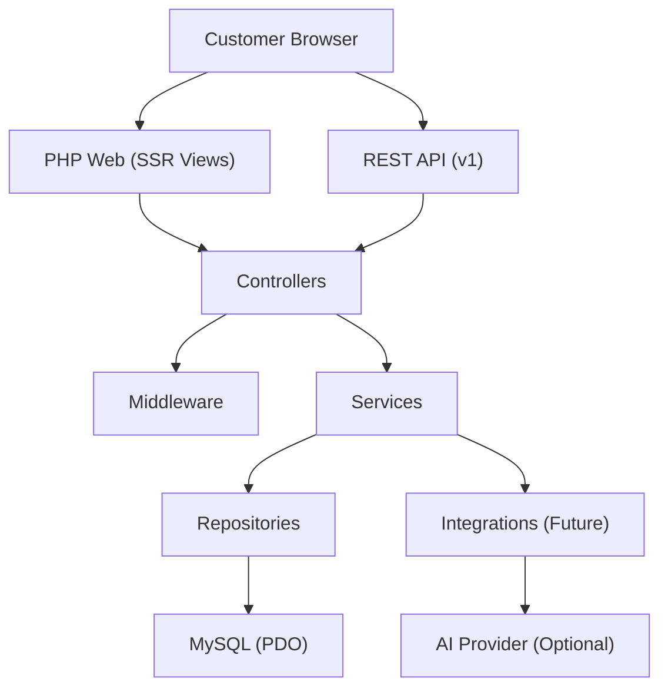
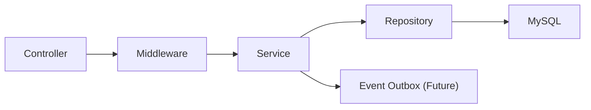
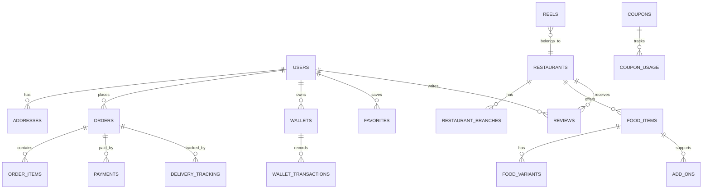

## 1. Architecture Design



### 1.1 Layer Responsibilities
- Routes: map URL → Controller action (web) or API endpoint (JSON).
- Controllers: request parsing, auth/permission checks, input validation orchestration, response shaping.
- Middleware: CSRF/session, JWT verification, rate limiting, role permissions, request id, locale/city context.
- Services: business logic (pricing, coupons, wallet, checkout orchestration, tracking state machine).
- Repositories: database access, query composition, pagination, transactions, locking.
- Views/Components: reusable PHP view partials with a small design system and progressive enhancement via vanilla JS.

## 2. Technology Description
- Runtime: PHP 8.2+
- Web Server: Apache/Nginx + PHP-FPM
- Database: MySQL 8.0+
- DB Access: PDO (prepared statements only)
- Auth: JWT for APIs + secure sessions for web (hybrid)
- Passwords: password_hash/password_verify (Argon2id if available)
- Frontend: Server-rendered HTML + modern CSS (token-based theme) + minimal vanilla JS for AJAX
- Realtime Tracking: polling-first endpoints, websocket-ready event model (future)
- Migrations/Seeders: file-based SQL migrations and PHP seeders (repeatable, idempotent)

## 3. Folder Structure (Target)
```text
/public
  /assets
  index.php
/app
  /Config
  /Controllers
    /Web
    /Api
    /AdminApi
  /Middlewares
  /Models
  /Repositories
  /Services
    /Auth
    /Cart
    /Checkout
    /Coupons
    /Wallet
    /Referral
    /Tracking
    /AI
  /Helpers
  /Views
    /layouts
    /components
    /pages
  /Validation
  /Http
    Request.php
    Response.php
  /Support
    Env.php
    Logger.php
    Pagination.php
  /Bootstrap
    App.php
/routes
  web.php
  api_v1.php
  admin_api_v1.php
/storage
  /logs
  /uploads
  /cache
/database
  /migrations
  /seeders
/.trae/documents
```

## 4. Route Definitions (Customer Web)
| Route | Purpose |
|-------|---------|
| / | Landing page |
| /home | Homepage feed |
| /restaurants | Restaurant listing |
| /r/{restaurant_slug} | Restaurant details |
| /categories/{category_slug} | Category page |
| /offers | Offer listing |
| /offers/{offer_slug} | Offer details |
| /trending | Trending foods |
| /couples | Couple meals |
| /midnight | Midnight delivery |
| /reels | Reels feed |
| /cart | Cart page |
| /checkout | Checkout |
| /orders/success/{order_public_id} | Order success |
| /orders/track/{order_public_id} | Live tracking UI |
| /wallet | Wallet |
| /referrals | Referral dashboard |
| /coupons | Coupons |
| /profile | Profile |
| /addresses | Address management |
| /notifications | Notifications |
| /orders | Order history |
| /reorder/{order_public_id} | Reorder |
| /favorites | Favorites |
| /support | Support chat/tickets |
| /pickup | Pickup orders |
| /about | About us |
| /contact | Contact us |
| /privacy | Privacy policy |
| /terms | Terms |

## 5. API Definitions (v1)

### 5.1 Response Envelope
```json
{
  "success": true,
  "data": {},
  "meta": { "request_id": "..." },
  "error": null
}
```

### 5.2 Auth APIs
| Method | Route | Purpose |
|--------|-------|---------|
| POST | /api/v1/auth/register | Email/password register |
| POST | /api/v1/auth/login | Email/password login |
| POST | /api/v1/auth/otp/request | Phone OTP request |
| POST | /api/v1/auth/otp/verify | Phone OTP verify + session/JWT |
| POST | /api/v1/auth/logout | Revoke session/JWT |
| POST | /api/v1/auth/forgot-password | Start reset flow |
| POST | /api/v1/auth/reset-password | Complete reset |
| GET | /api/v1/auth/me | Current user |
| GET | /api/v1/auth/sessions | Device/session list |
| DELETE | /api/v1/auth/sessions/{id} | Revoke session |

### 5.3 Discovery & Restaurant APIs
| Method | Route | Purpose |
|--------|-------|---------|
| GET | /api/v1/cities | City list |
| GET | /api/v1/restaurants | Listing with filters, pagination |
| GET | /api/v1/restaurants/{id} | Restaurant details |
| GET | /api/v1/restaurants/{id}/menu | Menu categories + items |
| GET | /api/v1/search | Keyword search (restaurants/items/reels) |
| GET | /api/v1/search/smart | Smart search (AI scaffolding) |
| GET | /api/v1/reels | Reels feed |

### 5.4 Cart & Checkout APIs
| Method | Route | Purpose |
|--------|-------|---------|
| GET | /api/v1/cart | Get cart |
| POST | /api/v1/cart/items | Add item/variant/add-ons |
| PATCH | /api/v1/cart/items/{id} | Update quantity/instructions |
| DELETE | /api/v1/cart/items/{id} | Remove item |
| POST | /api/v1/cart/apply-coupon | Validate/apply coupon |
| POST | /api/v1/checkout/preview | Price preview (tax/fees/cashback) |
| POST | /api/v1/checkout/place-order | Create order + payment intent |
| POST | /api/v1/payments/webhook/mock | Mock webhook (dev only) |

### 5.5 Orders & Tracking APIs
| Method | Route | Purpose |
|--------|-------|---------|
| GET | /api/v1/orders | Order history (paginated) |
| GET | /api/v1/orders/{id} | Order details |
| POST | /api/v1/orders/{id}/reorder | Reorder |
| GET | /api/v1/orders/{id}/tracking | Timeline + driver/location snapshot |
| POST | /api/v1/orders/{id}/support | Create support ticket |

### 5.6 Wallet / Referral / Coupons APIs
| Method | Route | Purpose |
|--------|-------|---------|
| GET | /api/v1/wallet | Balance + summary |
| GET | /api/v1/wallet/transactions | Ledger |
| POST | /api/v1/referrals/invite | Create/share invite |
| GET | /api/v1/referrals | Referral dashboard |
| GET | /api/v1/coupons | List available coupons |
| POST | /api/v1/coupons/validate | Validate coupon |

### 5.7 User APIs
| Method | Route | Purpose |
|--------|-------|---------|
| GET | /api/v1/profile | Profile |
| PATCH | /api/v1/profile | Update profile |
| POST | /api/v1/profile/avatar | Upload avatar |
| GET | /api/v1/addresses | Address list |
| POST | /api/v1/addresses | Create address |
| PATCH | /api/v1/addresses/{id} | Update address |
| DELETE | /api/v1/addresses/{id} | Delete address |
| GET | /api/v1/notifications | Notification list |
| POST | /api/v1/notifications/{id}/read | Mark as read |

### 5.8 Admin APIs (Backoffice)
| Method | Route | Purpose |
|--------|-------|---------|
| GET | /admin-api/v1/dashboard | Analytics summary |
| CRUD | /admin-api/v1/restaurants | Restaurant management |
| CRUD | /admin-api/v1/users | Customer management |
| CRUD | /admin-api/v1/orders | Order monitoring |
| CRUD | /admin-api/v1/coupons | Coupon engine management |
| CRUD | /admin-api/v1/wallet | Wallet adjustments |
| CRUD | /admin-api/v1/referrals | Referral analytics |
| CRUD | /admin-api/v1/banners | Marketing banners |
| CRUD | /admin-api/v1/cities | City management |
| CRUD | /admin-api/v1/settings | Platform settings |

## 6. Server Architecture Diagram (Controller → Service → Repository → DB)


## 7. Data Model (High-Level)

### 7.1 ER Diagram (Mermaid)


### 7.2 Key Tables & Constraints (Summary)
- Soft deletes: restaurants, food_items, users (optional), coupons (optional) via deleted_at.
- Public IDs: orders use order_public_id for URL safety.
- Money columns: DECIMAL(10,2) for currency; store currency code in settings (single-currency MVP).
- State machine: orders.status and delivery_tracking.status with allowed transitions enforced in service layer.

## 8. Security Architecture
- CSRF: required for state-changing web routes; APIs use JWT + origin checks (where applicable).
- XSS: escape output in views; strict Content-Security-Policy header architecture.
- SQL injection: PDO prepared statements only; no string concatenation for inputs.
- Rate limiting: middleware-ready with storage backend abstraction (DB table MVP, Redis optional later).
- Sessions: httpOnly, secure cookies, sameSite=Lax; device/session table for revocation.
- Uploads: MIME + extension allowlist, size limits, random filenames, virus-scan architecture hook.
- RBAC: roles + permissions tables; middleware checks permission strings per route group.
- Audit logs: admin actions produce audit log events (table + future outbox).

## 9. Performance Architecture
- Cache: cache interface with file-based storage MVP; easily swappable to Redis.
- Pagination: keyset pagination for large lists (optional) and offset pagination for simplicity.
- DB indexing: composite indexes on (city_id, is_active), (restaurant_id, category_id), (order.user_id, created_at).
- Media: responsive images, lazy loading, CDN-ready /public/assets and /storage/uploads.

## 10. AI Module Scaffolding
- AI services are internal interfaces with stub implementations:
  - RecommendationsService (personalization + fallback)
  - SmartSearchService (intent parsing + synonyms)
  - UpsellService (cart-based suggestions)
  - SupportBotService (ticket triage scaffolding)
- AI logs: ai_logs table stores prompts/inputs/outputs metadata (no PII by default).

## 11. Real-Time Order Tracking (Polling → WebSockets Ready)
- Polling endpoint: /api/v1/orders/{id}/tracking returns:
  - order status timeline events
  - driver snapshot (name, vehicle, phone masked)
  - last known coordinates and updated_at
  - ETA estimate with server calculation
- Websocket readiness:
  - delivery_tracking_events table (or event outbox) for pushing state changes
  - stable event schema and versioning
